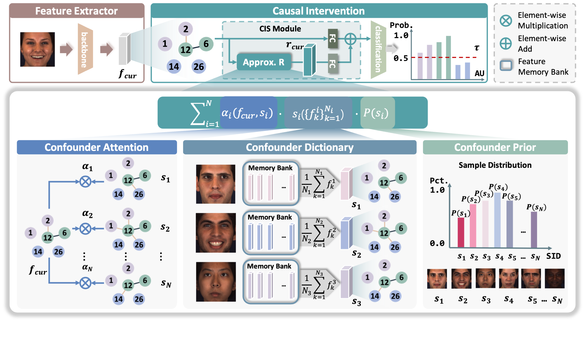

# Causal Intervention for Subject-Deconfounded Facial Action Unit Recognition

Implementation of "Causal Intervention for Subject-Deconfounded Facial Action Unit Recognition" (AAAI 2022)[paper]().

<p align="center">

</p>

## Dependencies
```bash
$ git clone https://github.com/echoanran/CIS.git $INSTALL_DIR
```
* python >= 3.6
* torch >= 1.1.0
* requirements.txt
```bash
$ pip install -r requirements.txt
```
* torchlight
```bash
$ cd $INSTALL_DIR/torchlight
$ python setup.py install
```

## Data Preparation
### Step 1: Download datasets
First, request for the access of the two AU benchmark datasets:
* [BP4D](http://www.cs.binghamton.edu/~lijun/Research/3DFE/3DFE_Analysis.html)
* [DISFA](http://mohammadmahoor.com/disfa/)

### Step 2: Preprocess raw data
Preprocess the downloaded datasets using [Dlib](http://dlib.net/)
* Detect face and facial landmarks
* Align the cropped faces according to the computed coordinates of eye centers
* Resize faces to (256, 256)

### Step 3: Split dataset for subject-exclusive 3-fold cross-validation
Split the subject IDs into 3 folds randomly

### Step 4: Generate feeder input files
Our dataloader `$INSTALL_DIR/feeder/feeder_image_causal.py` requires two data files (an example is given in `$INSTALL_DIR/data/bp4d_example`):
* `label_path`: the path to file which contains labels ('.pkl' data), [N, 1, num_class]
* `image_path`: the path to file which contains image paths ('.pkl' data), [N, 1]

## Training 
```bash
$ cd $INSTALL_DIR
$ python run-cisnet.py
```

## Citation
Please cite our paper if you use the codes:
```
@inproceedings{yingjie2022,
  title={Causal Intervention for Subject-Deconfounded Facial Action Unit Recognition},
  author={Chen, Yingjie and Chen, Diqi and Wang, Tao and Wang, Yizhou and Liang, Yun},
  booktitle={AAAI},
  year={2022}
}
```
